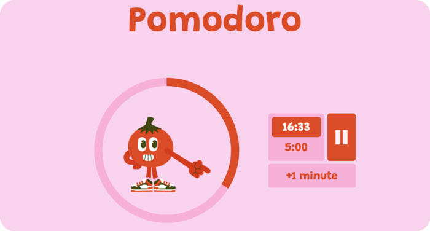

    

## Animated Pomodoro Timer

This is a simple animated Pomodoro timer implemented using HTML, CSS, and JavaScript. The timer alternates between work and break phases, helping users manage their time effectively.

### Features

- **Work and Break Phases**: The timer alternates between work and break phases, set to default values of 25 minutes for work and 5 minutes for a break although this is easily customisable. 
- **Pause and Resume**: Users can pause and resume the timer by clicking on the control button.
- **Add Time**: Additional time can be added to the current phase by clicking on the add time button.

### How to Use

1. Clone this repository to your local machine.
2. Navigate to the directory where you cloned the repository and install the dependencies using npm.
`npm install`
3. Start the server by running the following command in your terminal.`npm start`
3. Click on the control button to start the timer.
4. Click on the control button again to pause the timer. Click it once more to resume.
5. To add time to the current phase, click on the "Add Time" button.

### Code Overview

- The timer is implemented using HTML for structure, CSS for styling, and JavaScript for functionality.
- The `updateTimer` function formats and updates the displayed time.
- The `decrement` function handles the countdown, updates the timer display, and switches between work and break phases.
- The `setProgress` function updates the visual progress of the timer using SVG animations.

### Contributors
Developed with guidance from [Luca Terrazzan](https://github.com/Luca-Terrazzan) and the team at [Boolean](https://boolean.co.uk)
